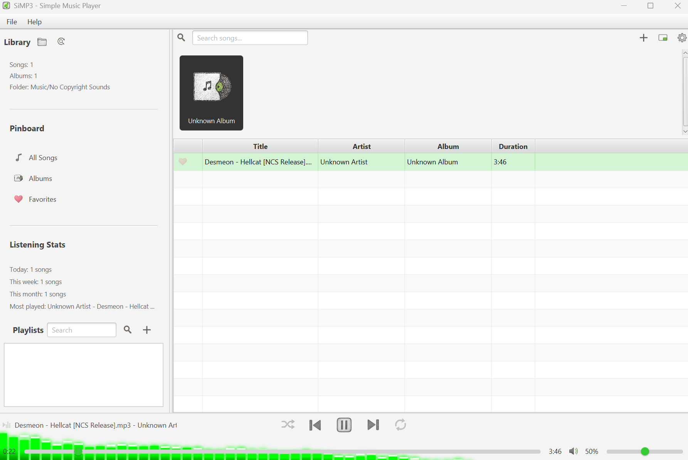
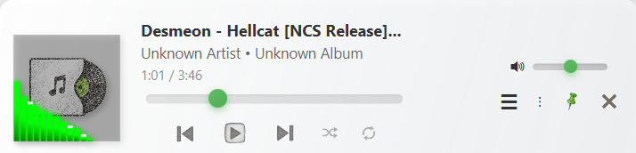

<div align="left">
    
    <br><br>
</div>

# SiMP3 - Simple Music Player

[](https://www.oracle.com/java/)
[](https://openjfx.io/)
[](LICENSE)
[](https://github.com/S1mplector/Simp3/releases)

**A lightweight, modern music player built with JavaFX that puts simplicity first.**

[Features](#-features) • [Screenshots](#-screenshots) • [Installation](#-installation) • [Usage](#-usage) • [Development](#-development) • [Contributing](#-contributing)

</div>

---

##  Overview

SiMP3 is a resource friendly multi-format music player designed for users who want a clean, efficient way to manage and enjoy their music collection. Built with JavaFX, it offers a modern interface while maintaining excellent performance on modest hardware.

### Why SiMP3?

- **Lightweight**: Minimal resource usage, great performance on older systems
- **Modern UI**: Clean, intuitive interface built with JavaFX
- **Auto-Updates**: Stay current with automatic update checking via GitHub
- **Smart Library**: Automatic music scanning and organization
- **Quality Playback**: Support for MP3, WAV, FLAC, and more

##  Features

###  Core Features
- **Multi-Format Support**: Play MP3, WAV, FLAC, and virtually all other audio formats
- **Library Management**: Automatic scanning and organization of your music collection
- **Playlist Creation**: Create, edit, and manage custom playlists
- **Favorites System**: Mark and access your favorite tracks easily
- **Activity Tracking**: Monitor your listening history and statistics

###  User Interface
- **Mini Player Mode**: Compact player for minimal screen usage
- **Audio Visualizer**: Real-time audio visualization with customizable colors
- **Album Art Display**: Automatic album artwork extraction and display
- **Pinboard**: Pin important songs and playlists for quick access

###  Advanced Features
- **Auto-Update System**: Automatic checking and installation of updates
- **Keyboard Shortcuts**: Control playback without touching the mouse
- **Shuffle & Repeat**: Multiple playback modes for any listening style
- **Volume Normalization**: Consistent volume across your library

##  Screenshots

<div align="center">
  
  <p><i>Main player interface with library and playlists</i></p>

  
  <p><i>User configurable settings window</i></p>

  
  <p><i>Mini player mode</i></p>
</div>

##  Installation

### Prerequisites
- Java 17 or higher
- Windows, macOS, or Linux

### Quick Start

1. **Download the latest release**
   ```bash
   # Visit the releases page
   https://github.com/S1mplector/Simp3/releases
   ```

2. **Run the installer** (Windows)
   ```bash
   SiMP3-Setup-1.0.0.exe
   ```

3. **Or run from JAR** (All platforms)
   ```bash
   java -jar simp3-1.0.0.jar
   ```

### Building from Source

```bash
# Clone the repository
git clone https://github.com/yourusername/simp3.git
cd simp3

# Build with Maven
mvn clean compile

# Run the application
mvn javafx:run

# Create executable
mvn clean package
```

##  Usage

### First Run
1. Launch SiMP3
2. Select your music folder when prompted
3. Wait for the initial library scan to complete
4. Start enjoying your music!

### Keyboard Shortcuts
| Action | Shortcut |
|--------|----------|
| Play/Pause | `Space` |
| Next Track | `Ctrl + →` |
| Previous Track | `Ctrl + ←` |
| Volume Up | `Ctrl + ↑` |
| Volume Down | `Ctrl + ↓` |
| Search | `Ctrl + F` |
| Mini Player | `Ctrl + M` |

### Managing Your Library
- **Add Music**: Click "Select Music Folder" or drag & drop files
- **Create Playlists**: Click the "+" button in the playlist section
- **Mark Favorites**: Click the heart icon next to any song

##  Development

### Project Structure
```
simp3/
├── src/main/java/com/musicplayer/
│   ├── core/                    # Core audio and library logic
│   ├── data/                    # Models and data persistence
│   ├── services/                # Business logic services
│   ├── ui/                      # JavaFX UI components
│   └── utils/                   # Utility classes
├── src/main/resources/
│   ├── css/                     # Stylesheets
│   ├── fxml/                    # FXML layouts
│   └── images/                  # Icons and assets
└── docs/                        # Documentation
```

### Technologies
- **Java 17+**: Core language
- **JavaFX 17+**: UI framework
- **Maven**: Build and dependency management
- **SLF4J + Logback**: Logging
- **Jackson**: JSON processing
- **JUnit 5**: Testing framework

### Setting Up Development Environment

1. **Install Prerequisites**
   - JDK 17 or higher
   - Maven 3.6+
   - Your favorite IDE 

2. **Clone and Import**
   ```bash
   git clone https://github.com/yourusername/simp3.git
   cd simp3
   # Open in your IDE
   ```

3. **Configure Auto-Updates** (Optional)
   
   Edit `src/main/java/com/musicplayer/utils/UpdateConfig.java`:
   ```java
   public static final String GITHUB_OWNER = "your-github-username";
   public static final String GITHUB_REPO = "simp3";
   ```

##  Contributing

Contributors are always welcome. Here's how you can help:

### Ways to Contribute
-  Report bugs and issues
-  Suggest new features
-  Submit pull requests
-  Improve documentation

### Development Process
1. Fork the repository
2. Create a feature branch (`git checkout -b feature/amazing-feature`)
3. Commit your changes (`git commit -m 'Add amazing feature'`)
4. Push to the branch (`git push origin feature/amazing-feature`)
5. Open a Pull Request

### Code Style
- Follow Java naming conventions
- Use meaningful variable and method names
- Add JavaDoc comments for public methods
- Write unit tests for new features

##  Roadmap

### Version 1.0.2 (Coming Soon)
- [ ] Equalizer with presets
- [ ] Lyrics display and sync
- [ ] Last.fm scrobbling
- [ ] Theme customization

##  Known Issues

- Audio visualizer may impact performance on older systems (can be disabled in settings)
- Some FLAC files with unusual encoding may not play correctly

##  License

This project is licensed under the MIT License - see the [LICENSE](LICENSE) file for details.

---

<div align="center">
  
**Made with ❤️ by S1mplector**

[Report Bug](https://github.com/yourusername/simp3/issues) • [Request Feature](https://github.com/yourusername/simp3/issues) • [Discussions](https://github.com/yourusername/simp3/discussions)

</div>
