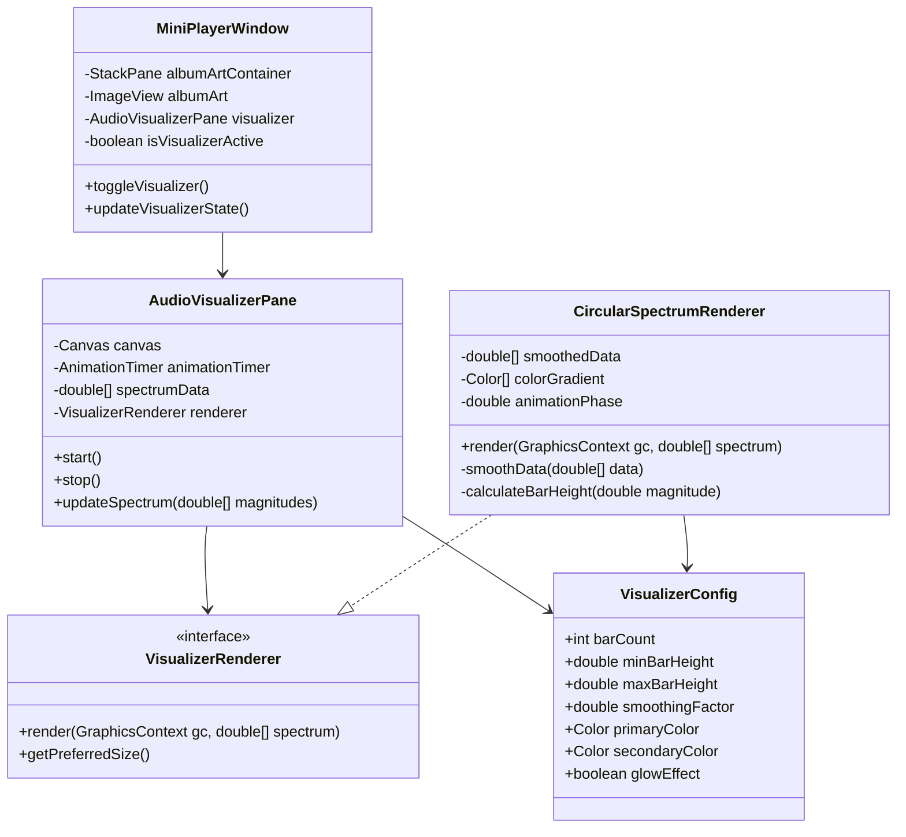
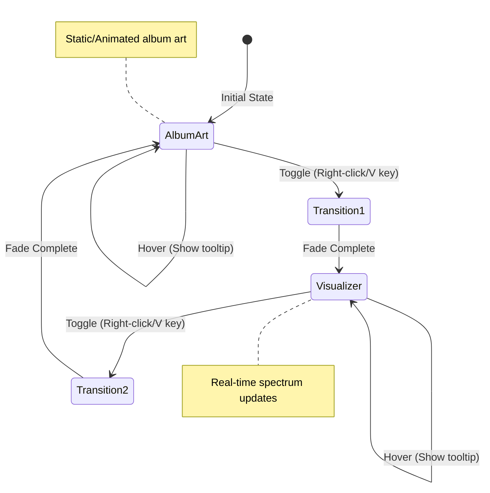

# SiMP3 Mini Player Audio Visualizer Design

## Executive Summary

This document outlines the design for an elegant audio visualizer feature for the SiMP3 mini player. The visualizer will provide real-time visual feedback synchronized with the music, enhancing the user experience while maintaining the mini player's minimalist aesthetic. The design focuses on performance, visual appeal, and seamless integration with the existing UI.

## Current State Analysis

### Mini Player Specifications
- **Window Size**: 480x120 pixels (expandable to 320px height with queue)
- **Album Art Area**: 80x80 pixels (left side)
- **Audio Engine**: JavaFX MediaPlayer with AudioSpectrumListener support
- **Spectrum Data**: 64 frequency bands at ~60 FPS
- **Supported Formats**: MP3/M4A (spectrum data available), FLAC/OGG (no spectrum support)

### Technical Constraints
- JavaFX-based UI framework
- Limited screen real estate
- Performance considerations for real-time rendering
- Need to maintain existing functionality

## Design Overview

### Visual Concept

The visualizer will feature a **circular radial spectrum** design that:
- Radiates from the center of the 80x80 album art area
- Uses smooth, flowing animations
- Incorporates the application's green color theme (#4CAF50)
- Provides subtle, non-distracting visual feedback

### Toggle Mechanism

Users can switch between album art and visualizer through:
1. **Right-click context menu** on album art area
2. **Keyboard shortcut**: `V` key when mini player is focused
3. **Smooth fade transition** between modes (300ms duration)

## Component Architecture



## Detailed Component Design

### 1. AudioVisualizerPane

**Purpose**: Container component that manages the visualizer canvas and animation loop.

**Key Features**:
- Extends `StackPane` for easy integration with existing album art container
- Contains a `Canvas` for hardware-accelerated rendering
- Manages `AnimationTimer` for smooth 60 FPS updates
- Handles spectrum data updates from audio engine

**Implementation Details**:
```java
public class AudioVisualizerPane extends StackPane {
    private Canvas canvas;
    private AnimationTimer animationTimer;
    private VisualizerRenderer renderer;
    private double[] spectrumData;
    private boolean isActive;
    
    // Smooth transition support
    private FadeTransition fadeIn;
    private FadeTransition fadeOut;
}
```

### 2. CircularSpectrumRenderer

**Purpose**: Renders the circular radial spectrum visualization.

**Visual Design**:
- 32 bars arranged in a circle (every other frequency band for performance)
- Bars grow outward from center based on magnitude
- Gradient coloring from green (#4CAF50) to light green (#81C784)
- Subtle glow effect using JavaFX shadow effects
- Smooth data interpolation to reduce jitter

**Algorithm**:
1. Apply exponential smoothing to spectrum data
2. Map 64 bands to 32 visual bars
3. Calculate bar heights using logarithmic scaling
4. Apply rotation animation for dynamic effect
5. Render with anti-aliasing and gradient fills

### 3. VisualizerConfig

**Purpose**: Centralized configuration for visualizer parameters.

**Configurable Parameters**:
- Bar count (default: 32)
- Minimum bar height (default: 5 pixels)
- Maximum bar height (default: 30 pixels)
- Smoothing factor (default: 0.8)
- Color scheme
- Animation speed
- Glow intensity

## User Interface Design

### Visual States

1. **Album Art Mode** (Default)
   - Standard album art display
   - Hover effect shows "Show Visualizer" tooltip

2. **Visualizer Mode**
   - Circular spectrum display
   - Subtle rotation animation
   - Hover effect shows "Show Album Art" tooltip

3. **Transition State**
   - Smooth fade between modes
   - No user interaction during transition

### Interaction Flow



## Implementation Approach

### Phase 1: Core Infrastructure
1. Create `AudioVisualizerPane` class
2. Implement basic `VisualizerRenderer` interface
3. Add toggle mechanism to `MiniPlayerWindow`
4. Set up spectrum data pipeline

### Phase 2: Circular Spectrum Renderer
1. Implement `CircularSpectrumRenderer`
2. Add data smoothing algorithms
3. Create color gradient system
4. Implement rotation animation

### Phase 3: UI Integration
1. Add context menu option
2. Implement keyboard shortcut
3. Create smooth transitions
4. Add tooltips and visual feedback

### Phase 4: Polish & Optimization
1. Performance profiling and optimization
2. Add configuration options
3. Handle edge cases (no audio data)
4. Add subtle particle effects (optional)

## Performance Considerations

### Optimization Strategies

1. **Reduced Bar Count**: Use 32 bars instead of 64 to reduce rendering overhead
2. **Canvas Rendering**: Leverage hardware acceleration through JavaFX Canvas
3. **Data Smoothing**: Prevent excessive redraws with temporal smoothing
4. **Conditional Rendering**: Only update when visualizer is visible
5. **Object Pooling**: Reuse graphic objects to reduce GC pressure

### Performance Targets
- CPU Usage: < 5% on modern systems
- Memory Overhead: < 10MB
- Frame Rate: Consistent 60 FPS
- Startup Time: < 100ms

## Fallback Behavior

### When Spectrum Data Unavailable (FLAC/OGG)
1. Display static wave pattern
2. Show message: "Visualizer not available for this format"
3. Automatically revert to album art
4. Disable visualizer toggle

### Error Handling
- Graceful degradation if rendering fails
- Automatic fallback to album art
- Log errors without disrupting playback

## Future Enhancements

### Version 2.0 Possibilities
1. **Multiple Visualizer Styles**
   - Horizontal waveform
   - Particle system
   - Frequency spiral

2. **Customization Options**
   - Color themes
   - Animation speed
   - Bar count adjustment

3. **Advanced Features**
   - Beat detection
   - Genre-based presets
   - User-created visualizations

## Technical Specifications

### Class Structure

```java
// Main visualizer component
public class AudioVisualizerPane extends StackPane {
    private static final int SPECTRUM_BANDS = 64;
    private static final int VISUAL_BARS = 32;
    private static final double SMOOTHING_FACTOR = 0.8;
    
    public void start();
    public void stop();
    public void updateSpectrum(double timestamp, double duration, 
                              float[] magnitudes, float[] phases);
}

// Renderer interface for extensibility
public interface VisualizerRenderer {
    void render(GraphicsContext gc, double[] spectrum, double width, double height);
    void reset();
    boolean supportsFormat(String audioFormat);
}

// Circular spectrum implementation
public class CircularSpectrumRenderer implements VisualizerRenderer {
    private double rotationAngle = 0;
    private double[] previousData = new double[VISUAL_BARS];
    
    @Override
    public void render(GraphicsContext gc, double[] spectrum, double width, double height);
}
```

### Integration Points

1. **MiniPlayerWindow.java**
   - Add visualizer pane to album art container
   - Wire up toggle mechanism
   - Connect spectrum listener

2. **AudioEngine Interface**
   - Already has `setAudioSpectrumListener()` method
   - No modifications needed

3. **CSS Styling**
   - Add `.visualizer-pane` styles
   - Define transition animations
   - Style context menu items

## Conclusion

This audio visualizer design provides an elegant, performant solution that enhances the SiMP3 mini player experience. The circular spectrum design fits perfectly within the existing 80x80 pixel album art area while maintaining the application's minimalist aesthetic. The implementation is modular, allowing for future enhancements and alternative visualizer styles.

The design prioritizes:
- **User Experience**: Smooth transitions and intuitive controls
- **Performance**: Optimized rendering with minimal resource usage
- **Aesthetics**: Consistent with SiMP3's visual design language
- **Extensibility**: Architecture supports future visualizer types

With this design, users can enjoy a dynamic visual representation of their music without sacrificing the compact, efficient nature of the mini player.